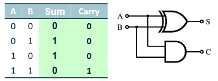
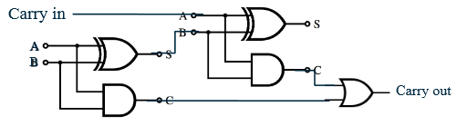

# Contents
- [Contents](#contents)
- [Number Systems](#number-systems)
  - [Positional Number Systems](#positional-number-systems)
  - [Binary](#binary)
  - [Hex](#hex)
  - [Bin to Hex](#bin-to-hex)
  - [Dec to Bin](#dec-to-bin)
  - [Dec Fractions to Bin](#dec-fractions-to-bin)
- [Binary Arithmetic](#binary-arithmetic)
  - [Addition in Binary](#addition-in-binary)
  - [Subtraction](#subtraction)
  - [Multiplication](#multiplication)
  - [Overflow](#overflow)
  - [Negative Numbers](#negative-numbers)
- [Floating Point Representation](#floating-point-representation)
- [Transistors and Logic Gates](#transistors-and-logic-gates)
  - [Transistors](#transistors)
  - [Gates](#gates)
  - [Supply Voltage](#supply-voltage)
  - [Logic Levels](#logic-levels)
  - [Static Discipline](#static-discipline)
  - [Moore's Law](#moores-law)
- [Boolean Algebra](#boolean-algebra)
  - [Functionally Complete Sets](#functionally-complete-sets)
  - [Digital Design Principles](#digital-design-principles)
  - [Circuits](#circuits)
  - [Combinational Logic](#combinational-logic)
  - [Boolean Algebra](#boolean-algebra-1)
  - [Sum of Products](#sum-of-products)
  - [Product of Sums](#product-of-sums)
  - [Axioms](#axioms)
- [Circuits](#circuits-1)
  - [Combinatorial circuits](#combinatorial-circuits)
- [Timing and Advanced Adders](#timing-and-advanced-adders)
  - [Timing](#timing)
  - [Critical Paths](#critical-paths)
  - [Gate Delay](#gate-delay)
  - [Hazard Removal](#hazard-removal)
  - [Adder](#adder)
  - [Carry-Lookahead adder](#carry-lookahead-adder)

# Number Systems
- Systems of expressing numbers with digits and/or symbols

## Positional Number Systems 
- Ordered sets of symbols for digits
- **Base**: number of symbols
- Positional umber systems represent values
- Subscript after a number gives base

## Binary
- Used in CPU as signal is discreet high or low
- Digits aka bits {0,1}
- Nibble: 4 bits
- Bytes: 8 bits
- Word: 32 bits

## Hex
- 16 symbols {0,1,2,3,4,5,6,7,8,9,A,B,C,D,E,F}
- Easier than binary to write and read (humans)
- Easy to convert

## Bin to Hex
- Separate Bin into nibbles, start from radix
- Translate Nibble to hex digit

## Dec to Bin
- Repeat mod div by 2 until result 0
- Put remainders of each mod div is bin from right to left

## Dec Fractions to Bin
- Multiply number by 2 until fractional part 0
- If $i$ th result greater than or equal to $1$ place $1$ in $i$ th position to right of radix
- Else place 0

# Binary Arithmetic
## Addition in Binary
- 8 rules:
```math
\begin{align*}
    0+0&=0 && Carry+0+0=1 \textrm{ with Carry }\\
    0+1&=1 && Carry+0+1=0 \textrm{ with Carry }\\
    1+0&=1 && Carry+1+0=0 \textrm{ with Carry }\\
    1+1&=0 \textrm{ with Carry } && Carry+1+1=1 \textrm{ with Carry }\\
\end{align*}
```

## Subtraction
- Do addition but with the negated subtrahend
- Example (2's Compliment):
- $10000-00101=10000+11011$

## Multiplication
- Use Long Multiplication
- Starting with the first digit, write the result directly under
- From then on, write the result but move it left by 1 column (replace this with a zero)
- If multiplied by a 1 then copy the result identically, and if multiplied by a 0 then the result is all 0s
- After going through all the numbers of the multiplend, add up all the result and this will give you the final value

## Overflow
- If answer does not fit in register overflow error occurs
- Triggers flag in the status register
- Can cause errors

## Negative Numbers
- **Signed Magnitude Representation:**
  - Single-bit flag: add 0 for positive 1 for negative at start of binary string
  - Two representations of 0 (1000 0000 and 0000 0000)
- **Ones-Compliment:**
  - Negative of number is representing by flipping all bits of it's positive
  - Two representations of 0 (00000000 and 11111111)
- **Two's Complement:**
  - Negative obtained by flipping each bit and adding 1
  - One representation of 0
  - Makes binary arithmetic simpler
- **Bias**
  - Used in storing floating point numbers
  - Stores $N$ as unsigned value $N+B$ where $B$ is a bias (normally half the unsigned range)
  - For $k$-bit numbers add bias $2^{k-1}-1$
    - Representation has range $-2^{k-1}-1$ to $2^{k-1}$

# Floating Point Representation
- Single Precision(32-bit) floating point
  - 1 bit sign
  - 8 bit exponent
  - 23 bit mantissa
- For Single precision(32-bit):
- Three fields
  - Sign bit(S)
    - 0 for positive
    - 1 for negative
  - Exponent(e)
    - Has bias 127
    - If $e$ has value:
      - |$e$ |Meaning|
        |---|---|
        |0 with $M=0$|gives number 0|
        |0 with $M\neq0$|gives subnormal numbers|
        |255 with $M=0$|$\pm \infty$|
        |255 with $M\neq0$|not a number|
  - Mantissa(M)
    - Scaled so radix point always after leading 1
- Represents $\pm M\cdot2^e$
- **Rounding Error**
  - Not all fractional parts can be represented fully accurately
  - Floating point operations should return closest representation to answer
# Transistors and Logic Gates
## Transistors
- Electrically controlled switches
- ON or OFF depending on current on control terminal
- Most common transistor is MOSFET(Metal-Oxide-Semiconductor Field Transistor)
- Make up logic gates which perform boolean logic
- nMOS:
  - 
  - current between d-s only if voltage on g
- pMOS
  - 
  - current between s-d only if no voltage on g
- Built from semiconductor(normally silicon)

## Gates
- AND
  - 
  - Algebraic: $Y=A\cdot B$
  - 
- OR
  - 
  - $Y=A\cdot B$
  - 
- XOR
  - 
  - $Y=A\oplus B$
  - 
- NOT
  -  
  - $Y=\bar{A}$
  - 
- NOR
  - 
  - $Y=\overline{A+B}$
  - OR but results on Y are all flipped

## Supply Voltage
- 0: Low voltage
- 1: High voltage
- Real voltages between 0 and 5
- Variance(noise) in values tolerated (4.6V = HIGH)
- Low voltage is connected to GND(ground)
- High voltage connected to $V_{DD}$
  - Moved to lower values in modern chips as less power and stop overloading transistors

## Logic Levels
- Way of mapping continuous voltage to 0 or 1
- 

## Static Discipline
- Guarantee that if inputs meet input thresholds then outputs meet output thresholds
- Grouped into logic families\;
  - 
  
## Moore's Law
- Transistor density doubles in 2 years
- Computer processing power doubles every 18 months

# Boolean Algebra
## Functionally Complete Sets
- Boolean operators which can be used to express all possible truth tables when combined in Boolean expression
- Example complete sets:
  - AND, OR, NOT
  - NOR 
    ```math 
    \begin{align*}
    A\cdot B &= \overline{\overline{A+A}+\overline{B+B}}\\
    A + B &= \overline{\overline{A+B}+\overline{A+B}}\\
    \bar{A} &= \overline{A+A}
    \end{align*}
    ```
  - NAND
    ```math 
    \begin{align*}
    A\cdot B &= \overline{\overline{A\cdot B}\cdot\overline{A\cdot B}}\\
    A + B &= \overline{\overline{A\cdot A}\cdot\overline{B\cdot B}}\\
    \bar{A} &= \overline{A\cdot A}
    \end{align*}
    ```
    - NAND chips use less silicon than NOR so more common as universal gates

## Digital Design Principles
- About managing complexity of many interacting elements
- Principles to help make easier
- Abstraction: Hiding unimportant details
- Discipline: Restricting design choices
- Three y's:
  - Hierarchy: Dividing system into modules/submodules
  - Modularity: Well defined functions and interfaces for modules
  - Regularity: Uniformity so modules can be swapped/reused

## Circuits
- Has:
  - One or more discrete valued input terminals
  - One or more discrete output terminals
  - Specification of relationship between inputs and outputs
  - Specification of delay between inputs changing and outputs responding
  - Made of elements which are circuits
    - elements connected by nodes(wires)

## Combinational Logic
- For large circuits
- Can be individual gates
- Every circuit element must be combinational circuit
- Every node is input or connecting to one input of a circuit element
- No cyclic paths

## Boolean Algebra
- Specify combinational circuits
- Analyse and simplify circuits
- Literal: variable or its inverse(complement)
- Product: AND of several literals
  - Minterm: product where all inputs to a function appear once each
- Sum(implicant): OR of several literals
  - Maxterm: sum where all inputs to function appear once each

## Sum of Products
- Every Boolean expression can be written as minterms ORed together
- $(A\cdot B\cdot C)+(A\cdot \bar{B} \cdot \bar{C})+(\bar{A}\cdot B\cdot C)$
- To simplify Boolean function using sum of products:
  - 
  - Write truth table identify all output 1s
  - AND together inputs for every output 1
  - OR together all products
  - $F(X,Y,Z) = \bar{X}\cdot\bar{Y}\cdot\bar{Z}+\bar{X}\cdot Y\cdot Z+x\cdot \bar{Y}\cdot Z+X\cdot Y\cdot\bar{Z}$

## Product of Sums
- Every Boolean expression can be written as macterms ANDed together
- $(\bar{A}+\bar{B}+\bar{C})\cdot(\bar{A}+B+C)\cdot(A+B+\bar{C})$
- To simplify Boolean function using product of sums:
  - 
  - AND together all inverses of input sets that give output 0

## Axioms


# Circuits
## Combinatorial circuits
- Output depends only on current input
- Half-Adder
  - 
- Adder
  - Inputs include carry from pervious bit using two half adders
  - 
- Ripple Carry Adder
  - 
- Subtractor
  - Adding negative as twos complement negative
  - 
- Decoder
  - Translates coded information from one format to another
  - Transforms set of digital inputs to equivalent decimal code at output
  - $N$ inputs and $2^N$ outputs
  - 
  - Larger decoders require more circuitry
  - Allow for deeper circuits with fewer transistors but slower response
- MUX(multiplexor)
  - Choose 1 few inputs to decide output
  - Input chosen by control input(selector)
  - 
  - S decides which input $D_0$ or $D_1$ become output
  - 
  - Has $k+2^k$ inputs and 1 out
  - 
  - MUX can be used for combinational logic functions
  - Can be used in ALU for selecting which operation to use on inputs
- Tristate
  - Like single transistor but fully disconnects when gate is 0
  - No current at all when gate 0 / not just low
  - 
  - 
  - 
- Inverting Tristate
  - 

# Timing and Advanced Adders
## Timing
- Delay between input changing and output adjusting
- Contamination delay: $t_{cd}$
  - mind delay before output change
- Propagation delaY: $t_{pd}$
  - max delay before output stable
- Caused by:
  - Capacitance and resistance
  - Speed of light limitation
- $t_{pd}$ and $t_{cd}$ can be different:
  - Different rising falling delays
  - Circuit may have multiple inputs and outputs, some faster than others
  - Circuit speed changes with temp

## Critical Paths
- Critical path:
  - Longest path in circuit
  - determines propagation delay
- Short path:
  - determines contamination delay

## Gate Delay
- Can result in hazards/glitches at output
- Manifest brief unwanted logic level changes
- Hazards:
  - Static: output undergoes a unwanted momentary change when one input changes
  - Dynamic: Output has multiple changes when one wanted
- 
## Hazard Removal
- Static hazard can be found in Karnaugh map
- 

## Adder
- Full adder we have 3 gate delays
- If can pre-compute level ome then only 2 gates from carry in arrival
- 
- For ripple adder this means many gate delays $3+2(k-1)=2k+1$

## Carry-Lookahead adder
- Uses two functions:   
  - Generate: $G(A,B) =1$ if $A$ and $B$ causes $C_{out}$ even if $C_{in}=0$
    - A AND B
  - Propagate: $P(A,B) = 1$ if $A$ and $B$ would cause $C_{out}$ if $C_{in}=1$
    - A OR B
  - Carry occurs if generated or propagated: $C_{out}=G(A,B)+P(A,B)\cdot C_{in}$$
  - Both Generate and Propagate take one gate delay
- Whole adder in 4 gate delays
- 
- To create CLA for n-bit numbers in constant gate delay requires order $n^2$ gates for $n$ inputs
- To reduce number of gates:
  - solution 1
    - Chain 4 bit CLAs as you would full adders
  - Solution 2
    - CLA into more CLA logic
